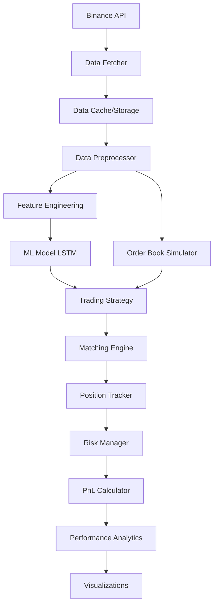

# HFT Simulator - Implementation Plan

## Project Overview

Building a **basic HFT simulator** focused on learning market microstructure, ML-based trading strategies, and quantitative performance evaluation.

**Key Principles:**
- Start simple, iterate to complexity
- Build incrementally with testable components
- Focus on data pipeline → order book → strategy → analytics flow

---

## System Architecture



---

## Project Structure

```
hft-sim/
├── data/                    # Historical market data
│   ├── raw/                 # Raw Binance data
│   └── processed/           # Cleaned and normalized data
├── src/
│   ├── data/                # Data fetching and preprocessing
│   │   ├── fetcher.py
│   │   ├── preprocessor.py
│   │   └── cache.py
│   ├── market/              # Market simulation
│   │   ├── orderbook.py
│   │   └── matching_engine.py
│   ├── ml/                  # Machine learning models
│   │   ├── features.py
│   │   └── models.py
│   ├── strategy/            # Trading strategies
│   │   └── momentum.py
│   ├── execution/           # Position and risk management
│   │   ├── position.py
│   │   └── risk.py
│   ├── backtest/            # Backtesting framework
│   │   └── engine.py
│   └── analytics/           # Performance metrics
│       ├── metrics.py
│       └── visualizations.py
├── tests/                   # Unit tests
├── notebooks/               # Jupyter notebooks for demos
├── requirements.txt
└── README.md
```

---

## Implementation Phases

### Phase 1: Foundation (Data Pipeline)
**Goal:** Fetch, store, and preprocess BTC-USD data

**Components:**
1. **Data Fetcher** - Pull klines/OHLCV from Binance public API
2. **Cache System** - Save to CSV/Parquet for offline use
3. **Preprocessor** - Normalize prices, handle missing data, create time index

**Key Decisions:**
- Use 1-minute candles initially (balance between resolution and data volume)
- Store 3-6 months of historical data
- Use pandas DataFrame as primary data structure

---

### Phase 2: Market Simulation
**Goal:** Build simplified order book and matching engine

**Components:**
1. **OrderBook Class** - Track best bid/ask, maintain price levels
2. **Matching Engine** - Execute market/limit orders with basic slippage model

**Simplifications for v1:**
- No full LOB depth (just best bid/ask + spread)
- Instant fills at market price + slippage
- No order cancellations initially

---

### Phase 3: ML Signal Generation
**Goal:** Predict short-term price direction

**Components:**
1. **Feature Engineering** - Returns, volatility, price changes, volume
2. **LSTM Model** - Binary classification (up/down) or regression (price change)

**Training Approach:**
- Walk-forward validation (train on past, predict future)
- 70/15/15 train/val/test split
- Target: 1-minute ahead price direction

---

### Phase 4: Strategy Implementation
**Goal:** Build simple momentum strategy using ML signals

**Logic:**
- ML model predicts probability of price increase
- Enter long if probability > 0.6, short if < 0.4
- Exit after N minutes or stop-loss hit
- Basic position sizing

---

### Phase 5: Backtesting & Analytics
**Goal:** Evaluate strategy performance quantitatively

**Metrics:**
- Sharpe Ratio
- Maximum Drawdown
- Win Rate
- Total Return
- Number of Trades

**Visualizations:**
- Equity curve
- Drawdown chart
- Trade distribution

---

## Key Technical Decisions

### Data Source
- **Binance Public API** - Free, reliable, good documentation
- Endpoints: `/api/v3/klines` for historical OHLCV

### ML Framework
- **PyTorch** - Flexibility for custom architectures
- Start with simple LSTM (1-2 layers)
- Consider adding attention mechanism later

### Performance Optimization
- Vectorized operations with NumPy/Pandas
- Avoid Python loops where possible
- Profile critical paths (order matching, feature calculation)

---

## Success Criteria (Basic Version)

✅ **Functional Requirements:**
- Successfully fetch and store 3+ months of BTC-USD data
- Order book can simulate basic market/limit orders
- ML model achieves >55% directional accuracy
- Strategy completes full backtest run
- Generate 5+ performance metrics

✅ **Code Quality:**
- Modular, testable components
- Clear separation of concerns
- Basic unit test coverage
- Documented functions and classes

---

## Next Steps After Basic Version

1. **Enhance Order Book** - Add depth, partial fills, order cancellations
2. **Improve ML** - Try transformer models, more features, ensemble methods
3. **Advanced Strategies** - Market making, mean reversion, arbitrage
4. **Risk Management** - Dynamic position sizing, volatility-based stops, VaR
5. **Performance** - Optimize critical paths, parallel processing
6. **Real-time** - WebSocket integration for live data simulation

---

## Notes

- Keep it simple initially - working end-to-end system is better than perfect components
- Focus on learning objectives: understand market dynamics and ML integration
- Document assumptions and simplifications
- Build with extensibility in mind (easy to add complexity later)